# Lab 01

### Jeff Putlock, putloj@rpi.edu

## Reading Assignments

#### More questions on How To Answers Questions in a Helpful Way:
- When providing an answer, probe to see if the person asking the question understands the approach, or would prefer a different frame of reference.
- Remain human; showing some empathy to another person's frustration can relieve some of their frustration and can save both of you a lot of time and emotional energy.
#### Write a short paragraph ( 8 to 10 sentences) of what you got out of reading chapter 3 from [Free Culture](http://www.free-culture.cc/freeculture.pdf).
Essentially, software is a double-edged blade. Creating a piece of software is the first of many responsibilities when it comes to maintaining a project. Once your software is released to the world, it is still the programmer/maintainer's responsibility to oversee what is done with said program. In this case, Jesse created a search engine and it was used for piracy; even though he himself was not caught pirating or enticed others to pirate, he was still the one branded a pirate. In order to counteract this, he should have used a license on his software to no longer make him liable for such actions. Alternatively, instead of focusing on development (as many programmers do), he should have stepped back and taken a look at what his program was being used for or how to best serve his goal. He could have formulated a terms of service or some other document that bound users liable for their own actions. In conclusion, developers should be monitoring the uses of their software because users are very good at exploiting possible extra uses that the developers did not intend.

## Linux
screenshot here: 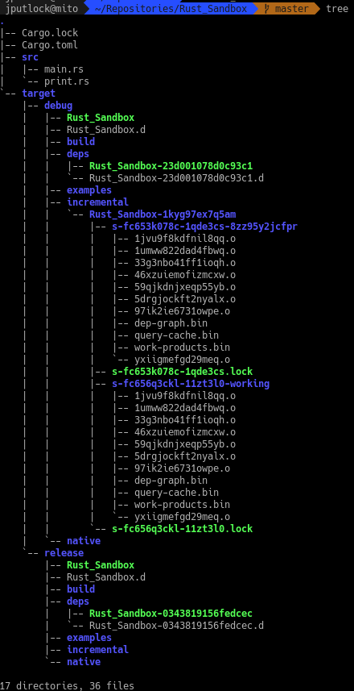

## Regex

7 regex problems:
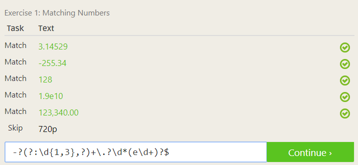
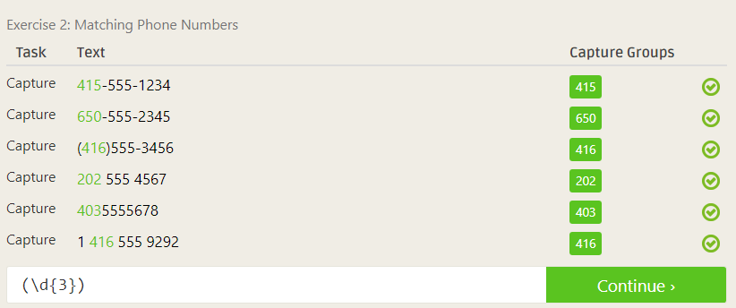
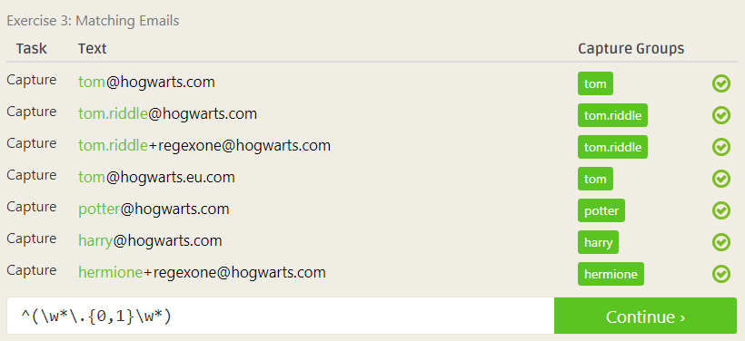
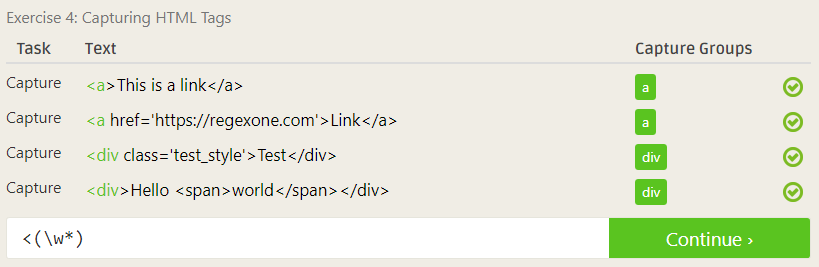
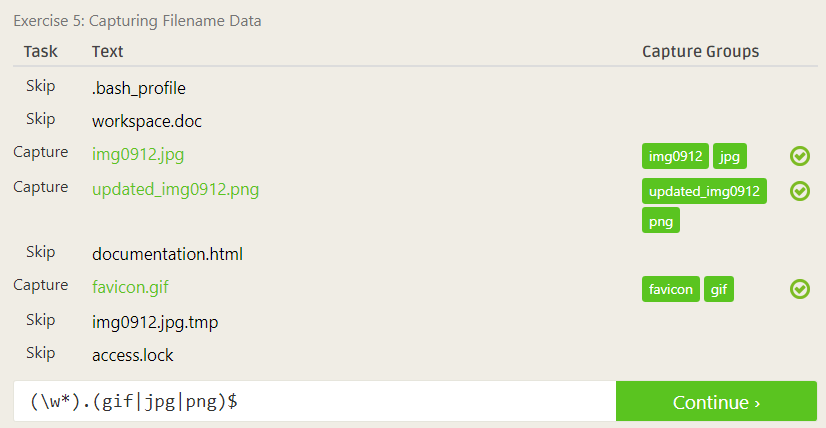
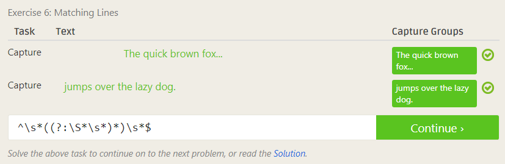
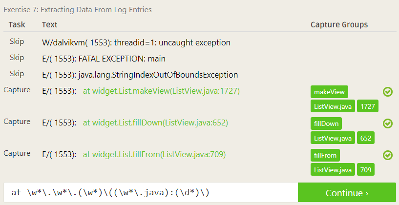

4 regex crosswords:
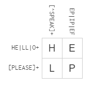
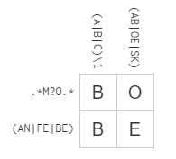
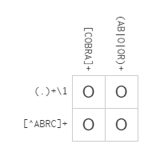
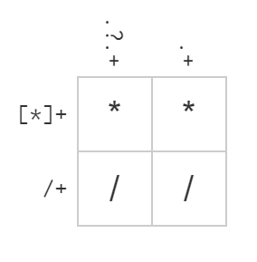

Snap/Blockly Progress here: 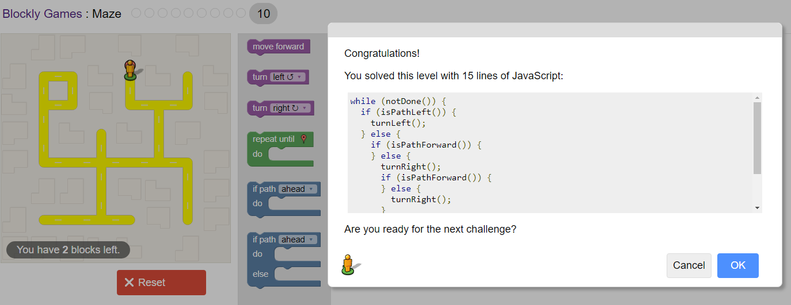

## Reflection
