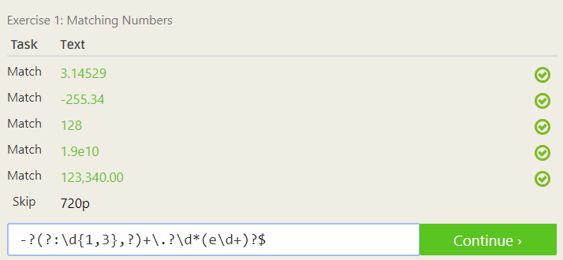
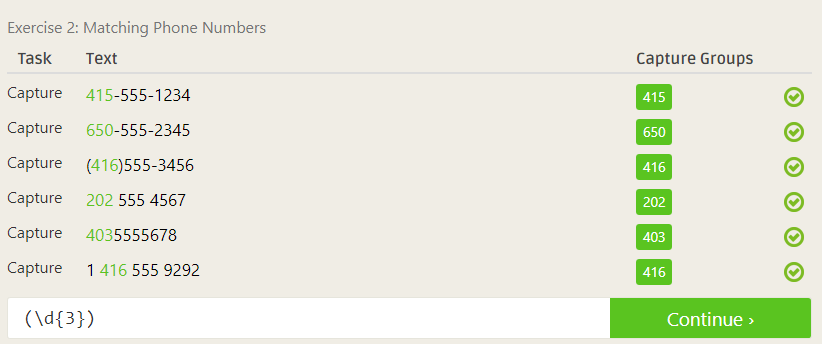
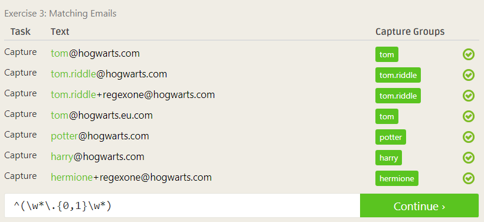
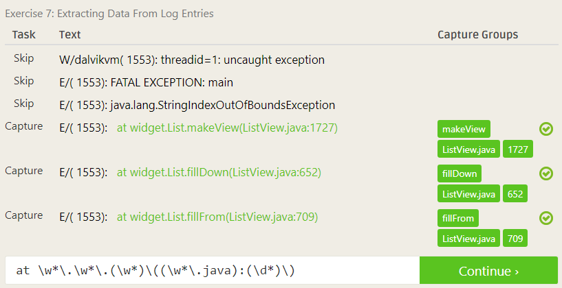

# Lab 01

### Jeff Putlock, putloj@rpi.edu

## Reading Assignments

#### More questions on How To Answers Questions in a Helpful Way:
- When providing an answer, probe to see if the person asking the question understands the approach, or would prefer a different frame of reference.
- Remain human; showing some empathy to another person's frustration can relieve some of their frustration and can save both of you a lot of time and emotional energy.
#### Write a short paragraph ( 8 to 10 sentences) of what you got out of reading chapter 3 from [Free Culture](http://www.free-culture.cc/freeculture.pdf).
Essentially, software is a double-edged blade. Creating a piece of software is the first of many responsibilities when it comes to maintaining a project. Once your software is released to the world, it is still the programmer/maintainer's responsibility to oversee what is done with said program. In this case, Jesse created a search engine and it was used for piracy; even though he himself was not caught pirating or enticed others to pirate, he was still the one branded a pirate. In order to counteract this, he should have used a license on his software to no longer make him liable for such actions. Alternatively, instead of focusing on development (as many programmers do), he should have stepped back and taken a look at what his program was being used for or how to best serve his goal. He could have formulated a terms of service or some other document that bound users liable for their own actions. In conclusion, developers should be monitoring the uses of their software because users are very good at exploiting possible extra uses that the developers did not intend.

## Linux
screenshot here: 

## Regex

7 regex problems:

4 regex crosswords:

Snap/Blockly Progress here: 

## Reflection

My plan is to work on a website to help others plan out their schedule at RPI for the upcoming years. I saw there are a lot of calendar apps in the RCOS project pool, but this one would be more towards helping out a specific subset of students. When I entered the Institute, I wanted to work on a dual in Mathematics and Computer Science. However, the tools you are provided as a freshman (and that you continue to use through your other years) are not very helpful for this endeavor. My goal is to create a website of some sort such that students can pick classes they want to take, and via the power of the RPI Catalog, can generate possible schedules throughout the 4 years. This can then be paired with YACS to then validate actual schedules (since the catalog isn't always true, such as it saying a class is fall annually, but the class doesn't run). The user would be able to look at all of the possible schedules, and choose subsets of them. A side goal could be to check major requirements to see if you are on board to graduate on time (except better than DegreeWorks, since it doesn't work with anything other than one major!).
