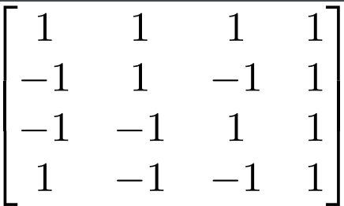

# Lab 03

My project is exploring the area of technology that helps with maximizing efficiency and usability. It is meant to be a general "make your life better" tool. Right now, the project is a LaTeX editor for Computer Science and Mathematics students (wow, it seems that could be useful right now for this class!). Since LaTeX is a compiled language, there is a delay between seeing what you're typing and seeing how it renders. There are (3) main options right now for people writing in LaTeX:
1. WYSIWYG editors that split the screen in half: the left half showing the LaTeX and the right half showing either an auto-compiling or delayed compile version of the rendered LaTeX. This is good for large documents but not as much for rapid note-taking.
2. Writing LaTeX in a general purpose text editor and compiling through command line, and opening a PDF or other format in some PDF viewer.
3. Using an online tool such as [Overleaf](https://www.overleaf.com). Although Overleaf comes with many great features such as the **Rich Text** tool that my project is inspired by, it is an _online_ resource, which immediately implies a downside - you need the internet to use it. Not only that, but it is slower than a compilation on the computer.

Right now, the technologies I'm looking at to implement are [pdf2svg](https://github.com/dawbarton/pdf2svg) for speedy PDF to SVG conversion and [GTKmm](https://www.gtkmm.org/en/) for creating a GUI.

The end product should be a lightweight Javascript-free LaTeX editor that renders LaTeX in real time in one document. See [Overleaf's Rich Text implementation](https://www.overleaf.com/blog/81-having-a-hard-time-convincing-your-coauthors-to-learn-latex-with-our-rich-text-mode-you-no-longer-need-to-dot-dot-dot) for a taste of the goal. In essence, I will be compartmentalizing a LaTeX document into a structure such that I can render chunks of LaTeX and interlace those with normal text.

## LaTeX:

