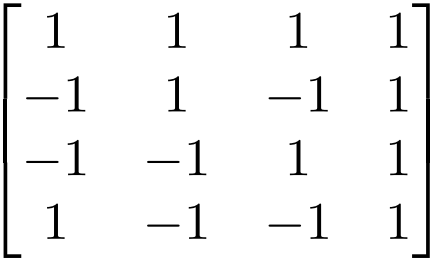

# Lab 03

## Documentation

My project is exploring the area of technology that helps with maximizing efficiency and usability. It is meant to be a general "make your life better" tool. Right now, the project is a LaTeX editor for Computer Science and Mathematics students (wow, it seems that could be useful right now for this class!). Since LaTeX is a compiled language, there is a delay between seeing what you're typing and seeing how it renders. There are (3) main options right now for people writing in LaTeX:
1. WYSIWYG editors that split the screen in half: the left half showing the LaTeX and the right half showing either an auto-compiling or delayed compile version of the rendered LaTeX. This is good for large documents but not as much for rapid note-taking.
2. Writing LaTeX in a general purpose text editor and compiling through command line, and opening a PDF or other format in some PDF viewer.
3. Using an online tool such as [Overleaf](https://www.overleaf.com). Although Overleaf comes with many great features such as the **Rich Text** tool that my project is inspired by, it is an _online_ resource, which immediately implies a downside - you need the internet to use it. Not only that, but it is slower than a compilation on the computer.

Right now, the technologies I'm looking at to implement are [pdf2svg](https://github.com/dawbarton/pdf2svg) for speedy PDF to SVG conversion and [GTKmm](https://www.gtkmm.org/en/) for creating a GUI.

The end product should be a lightweight Javascript-free LaTeX editor that renders LaTeX in real time in one document. See [Overleaf's Rich Text implementation](https://www.overleaf.com/blog/81-having-a-hard-time-convincing-your-coauthors-to-learn-latex-with-our-rich-text-mode-you-no-longer-need-to-dot-dot-dot) for a taste of the goal. In essence, I will be compartmentalizing a LaTeX document into a structure such that I can render chunks of LaTeX and interlace those with normal text.

### LaTeX:

This was compiled with the following LaTeX:
```
\[ \sqrt{ 1 + 2 \sqrt { 1 + 3 \sqrt { 1 + 4 \sqrt { 1 + \ldots} } } }  \]     
                                                                                
\[ \sqrt{2}^{\sqrt{2}^{\sqrt{2}^{ \sqrt{2} \ldots } } } \] 
```


This was compiled with the following LaTeX:
```
\begin{equation}                                                              
	\begin{bmatrix}                                                             
		1 & 1 & 1 & 1 \\                                                          
		-1 & 1 & -1 & 1 \\                                                        
		-1 & -1 & 1 & 1 \\                                                        
		1 & -1 & -1 & 1                                                           
	\end{bmatrix}                                                               
\end{equation} 
```



## Community

### Catan-AI
- 3 contributors
- 4058 lines of code
- first commit: 97f641bc3e670d9823ae7e11d842f12af6171707
- latest commit: e4963f4d0810a57f761ea4e0245bc4e52977a333
- 4 active branches: master, Simple_Bot, CatanResearch, Empty_Bot
- 2 stale branches: add-license-1, Ports

Gitstats says:
- 5 authors
- 2937 lines of code (4065 added, 1128 removed)
- first commit: 2019-01-14 (no key provided)
- latest commit: 2019-03-16 (no key provided)
- no branches provided

### Beir Run
- Number of contributors: 2
- Number of lines of code: 14,225
- First commit: 2019-03-12 (37c204611bb1029aad391aa4ada00649cffb1884)
- Latest commit: 2019-04-26 (6bf2d7349e1f6d57f487b5d54192b584539d7592)
- Current branches: master, Demo

GitStats Results:

- Number of authors: 4
- Number of lines of code: 11,314
- Commit information not provided
- Branch information not provided

### Code Buddy
- 2 contributors
- 1336 lines of code
- first commit: 2019-03-19
- latest commit: 2019-04-25
- current branches: master add-code-of-conduct1

When I ran gitstats on CodeBuddy the total lines of code different from the number I had earlier. Gitstats says the project has 1288 lines or code. Also, gitstats provides a lot more detail on how the files changed and how many commits each author made through graphs.

### ckRGB
- Contributors: 3

- Lines of code: 68789

- First Commit: Mar 10, 2019

- Final Commit: Jun 7, 2019

- Current Branches: master, c_api, hardware

The lines of code differ a lot from the html and terminal output. From the terminal, I have 68789. From the gitstats output, I have 41272. The reason why there is a difference is probably because the command ran in the terminal takes in account of every document in the repository, which includes documentations and README.md. The gitstats only looks for lines of code that are actually working, which excludes the documentations. 
