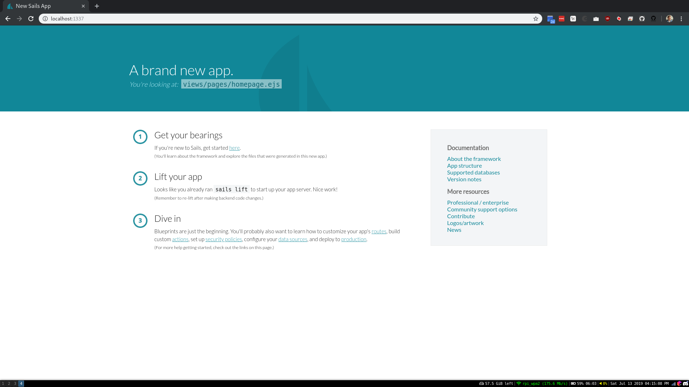

# Lab 06

## Example 0

I ran the command `docker run docker/whalesay cowsay boo` which starts the image in a new container named `docker/whalesay` and runs the command `cowsay boo`.

It produced this image:

## Example 1

I ran the command `docker run -it ubuntu bash` which starts a new container named `ubuntu` and runs `bash` in it. The flag `-i` indicates that we want it to be an interactive container, while the flag `-t` indicates that we want a terminal in the docker container which makes sense since we are calling bash.

I then ran `apt update` and `apt install vim` to update the packages in the Ubuntu instance and installed `vim`. I then installed `cowsay` and had to run `su` to refresh the PATH and ran `cowsay moo!` to see the output of the cowsay command.

## Example 2

I tried... it no worky

## Example 3

I created a Dockerfile that told Docker how I wanted my image set up. By using `FROM`, I set `python:3.5` as my base image and then I used `RUN` to run various commands to update and grab files. Through other commands such as `ENV` and `WORKDIR` I set up important environment variables and the working directory. By using the `EXPOSE` command, I allowed the container to listen to specified ports at runtime. Via `CMD` I was able to actually run the application in the container.

In the end, I captured this image after building and running the container

## Example 4

I wrote `docker-compose.yml` to set up a container to run the database that the Node.js container (made by the Dockerfile) can use. By running `docker-compose build` and `docker-compose up`, I built and ran the container to allow the mongoDB database to run. I then tried various commands resulting in the following images:

