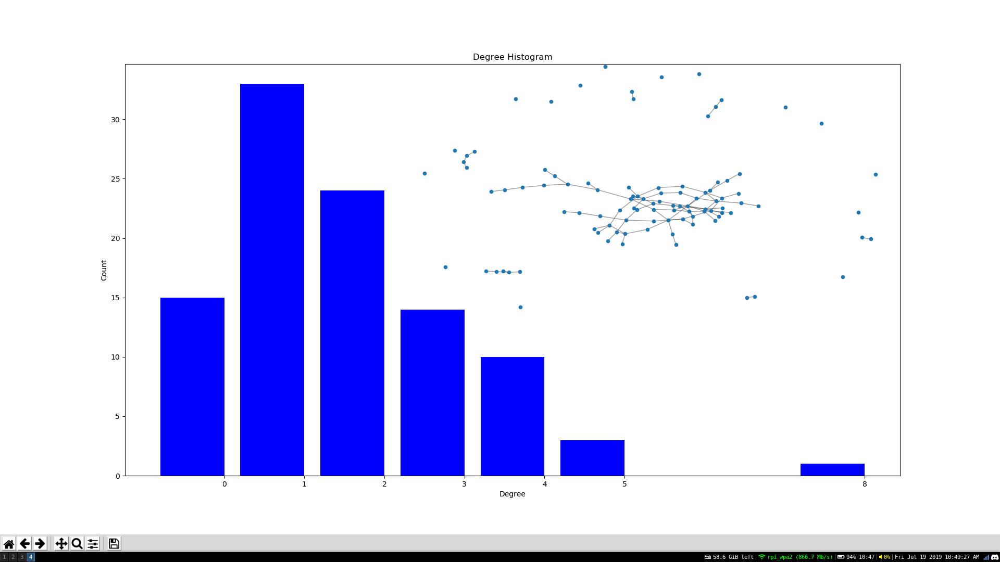

# Lab 07

## Trying the intro code




## Trying on different targets

Code for 5 letter solution:
```python
for (source, target) in [('chaos', 'order'),
                         ('nodes', 'graph'),
                         ('moron', 'smart'),
                         ('flies', 'swims'),
                         ('mango', 'peach'),
                         ('pound', 'marks')]:
```

Five letter solutions:
```
Loaded words_dat.txt containing 5757 five-letter English words.
Two words are connected if they differ in one letter.
Graph has 5757 nodes with 14135 edges
853 connected components
Shortest path between chaos and order is
chaos
choos
shoos
shoes
shoed
shred
sired
sided
aided
added
adder
odder
order
Shortest path between nodes and graph is
nodes
lodes
lores
lords
loads
goads
grads
grade
grape
graph
Shortest path between moron and smart is
moron
boron
baron
caron
capon
capos
capes
canes
banes
bands
bends
beads
bears
sears
stars
start
smart
Shortest path between flies and swims is
flies
flips
slips
slims
swims
Shortest path between mango and peach is
mango
mange
marge
merge
merse
terse
tease
pease
peace
peach
Shortest path between pound and marks is
None
```

Code for 4 letter solution:
```python
for (source, target) in [('cold', 'warm'),
                         ('love', 'hate'),
                         ('good', 'evil'),
                         ('pear', 'beef'),
                         ('make', 'take')]:
```

Four letter solutions:
```
Loaded words_dat.txt containing 5757 five-letter English words.
Two words are connected if they differ in one letter.
Graph has 2174 nodes with 8040 edges
129 connected components
Shortest path between cold and warm is
cold
wold
word
ward
warm
Shortest path between love and hate is
love
hove
have
hate
Shortest path between good and evil is
None
Shortest path between pear and beef is
pear
bear
beer
beef
Shortest path between make and take is
make
take
```

## Unordered Implementation
```python
# give possible off-by-ones
def edit_distance_one(word):
    for word_perm in perms(word, len(word)):
        for i in range(len(word_perm)):
            for letter in lowercase:
                new_word = ''.join(word_perm)
                new_word = new_word[:i] + letter + new_word[i+1:]
                yield new_word
```
Unordered answer for 5-length words:
```
Loaded words_dat.txt containing 5757 five-letter English words.
Two words are connected if they differ in one letter.
Graph has 5757 nodes with 119845 edges
16 connected components
Shortest path between chaos and order is
chaos
chose
chore
coder
order
Shortest path between nodes and graph is
nodes
anode
agone
anger
gaper
graph
Shortest path between moron and smart is
moron
manor
roams
smart
Shortest path between flies and swims is
flies
isles
semis
swims
Shortest path between mango and peach is
mango
conga
capon
poach
peach
Shortest path between pound and marks is
pound
mound
modus
dorms
drams
marks
```
