# Lab 08

## Data Visualization with ggplot2

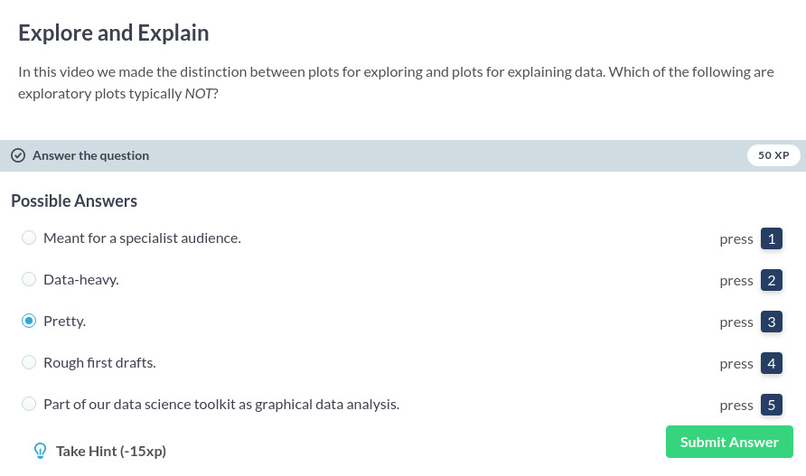

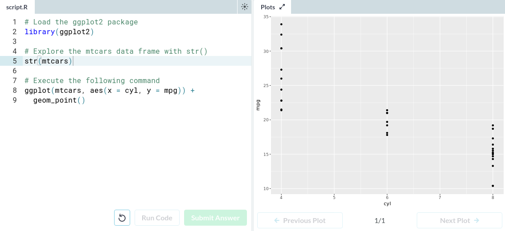

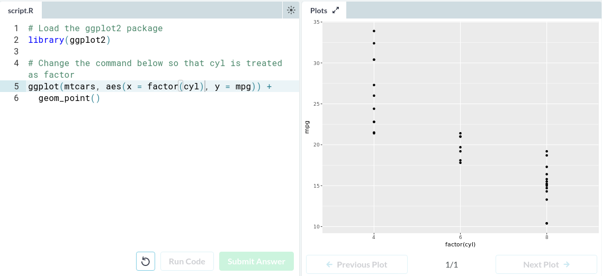

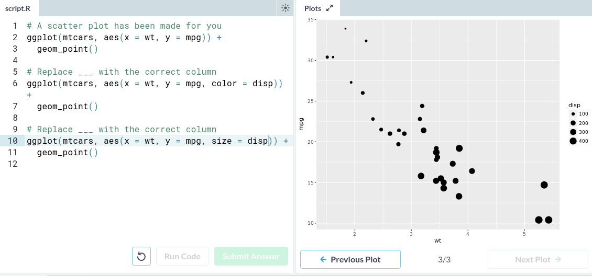

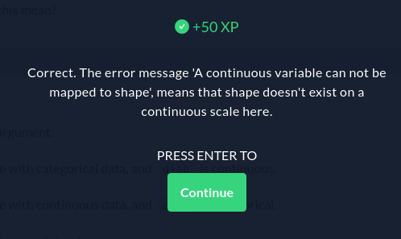

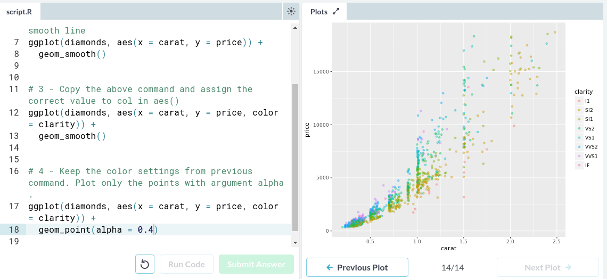

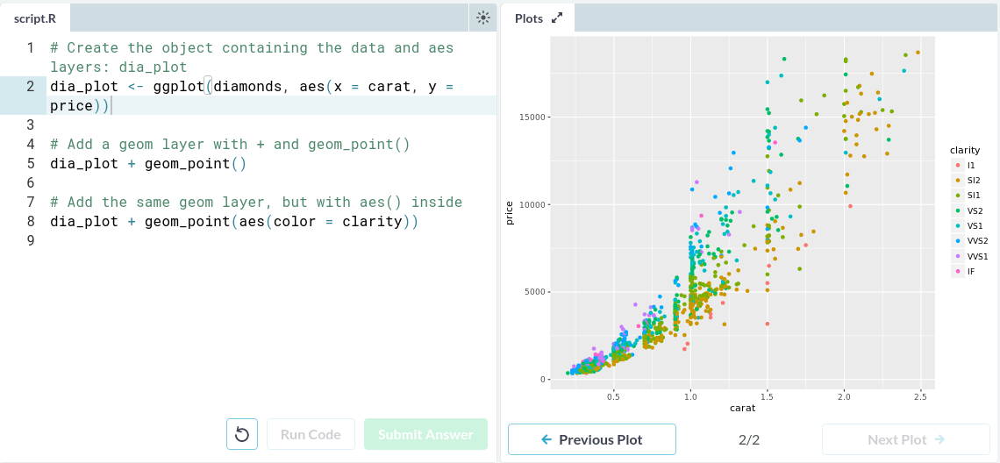

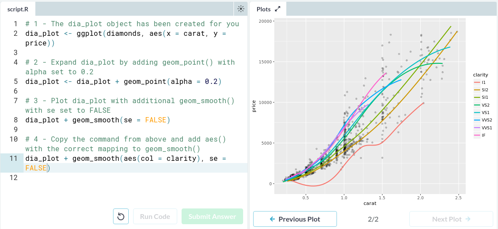

## Parallel Slopes and Multiple Regression

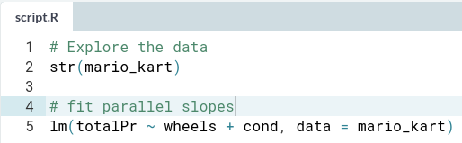

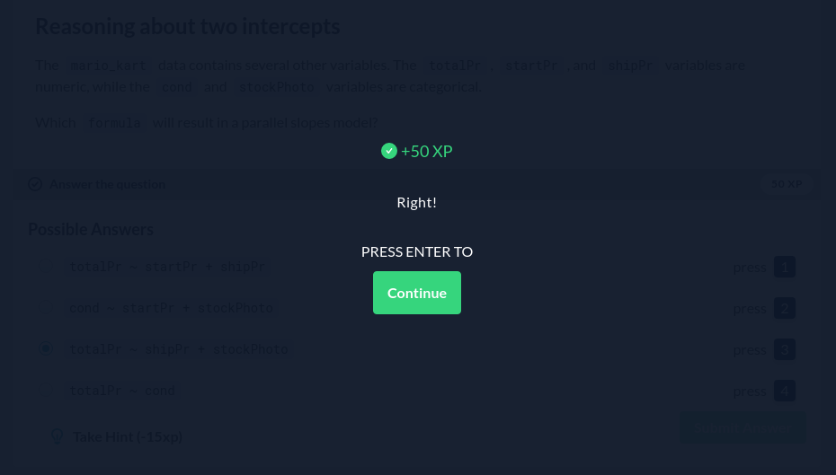

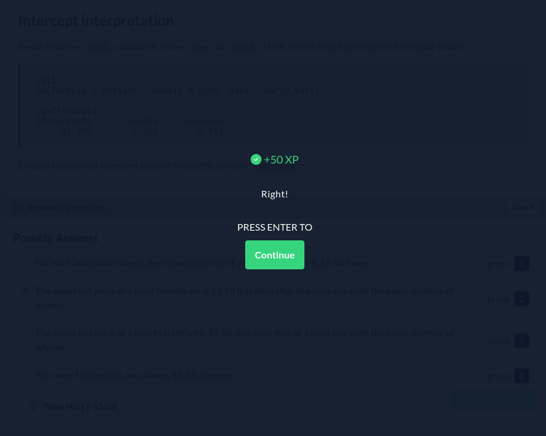

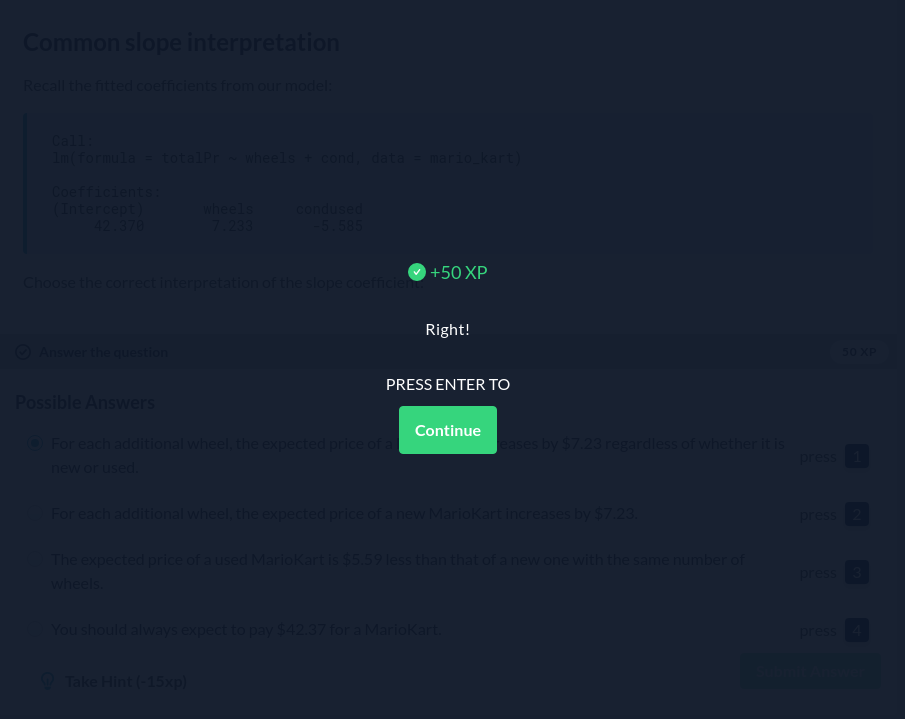

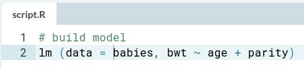

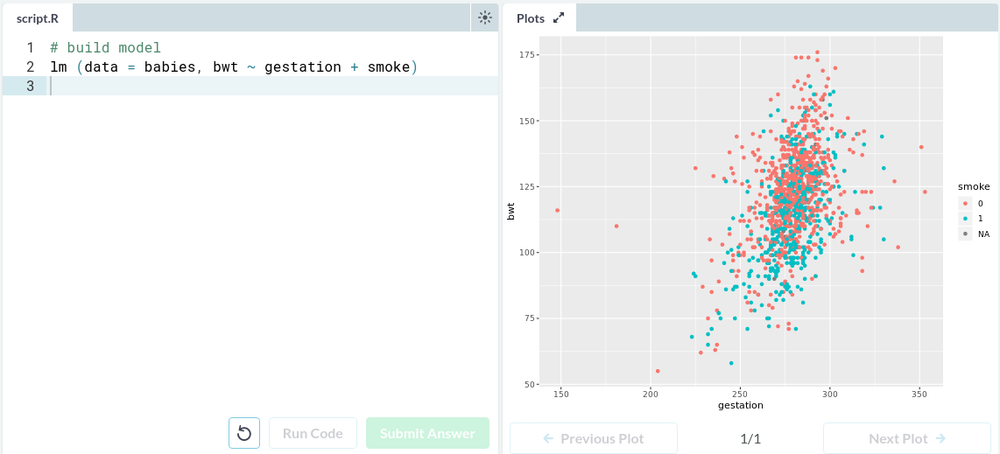

## Observatory

[Link to NoTeX on Observatory](https://rcos.io/projects/team-notex/notex/profile)
