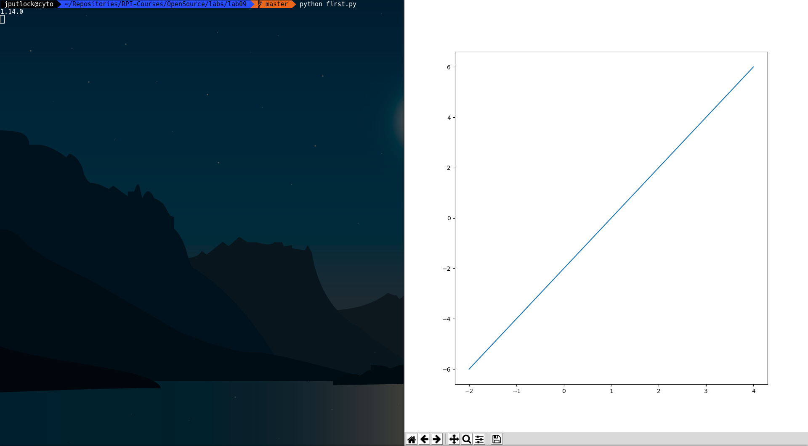
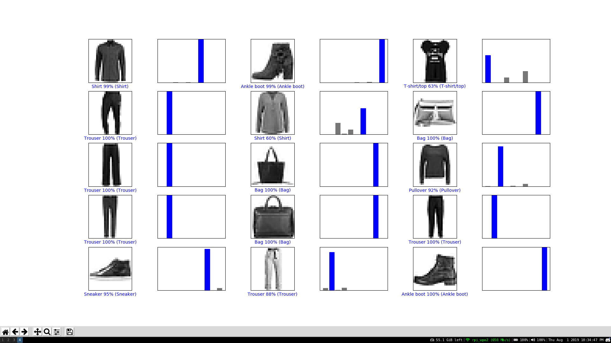
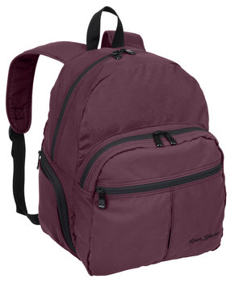
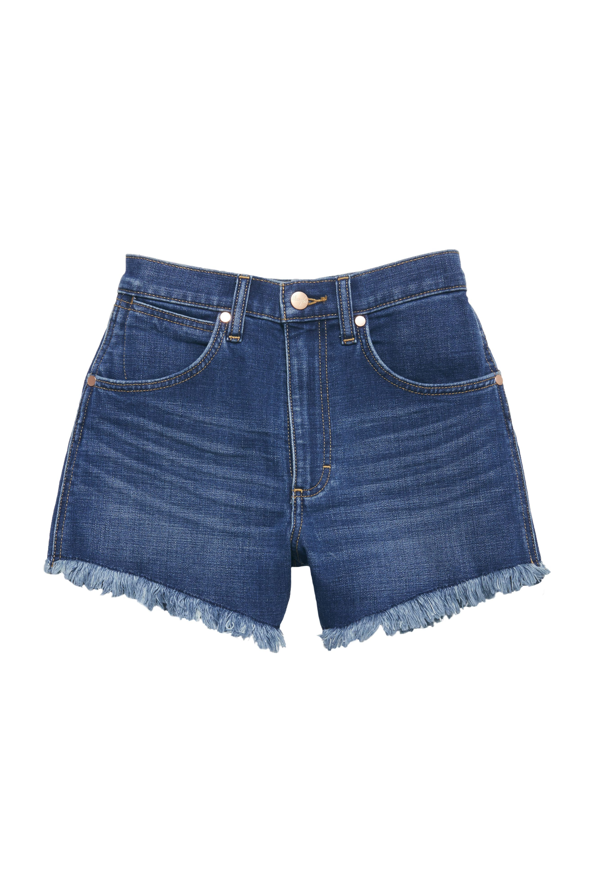
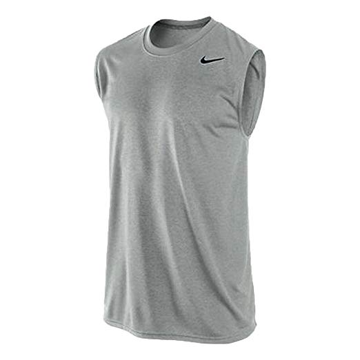
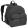
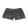
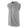
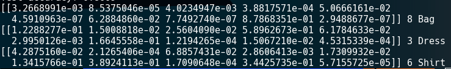

# Lab 09

## Part 1

## Part 2

## Part 3

First I curated the following pictures:

I then transformed them into the following photos, and used the ImageOps module to finish the adjustments necessary:

I then got the following results:

